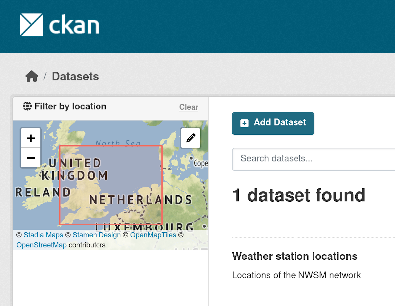

# ckanext-spatial - Geo related plugins for CKAN

This extension contains plugins that add geospatial capabilities to
[CKAN](http://ckan.org).

You should have a CKAN instance installed before adding these plugins.
Head to the [CKAN documentation](http://docs.ckan.org) for information
on how to set up CKAN.

The extension allows to perform spatial queries and display the dataset
extent on the frontend. It also provides harvesters to import geospatial
metadata into CKAN from other sources, as well as commands to support
the OGC CSW standard via [pycsw](http://pycsw.org).

