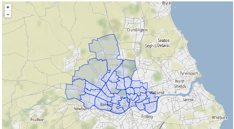
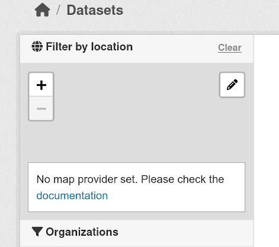
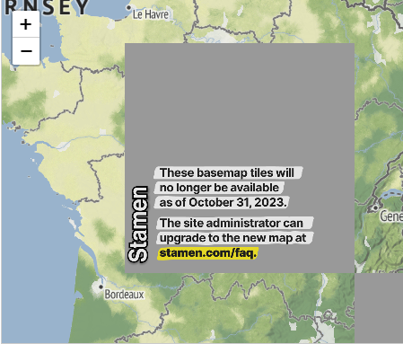

Common base layers for Map Widgets
==================================

To provide a consistent look and feel and avoiding code duplication, the map
widgets (at least the ones based on `Leaflet`_) can use a common function to
create the map. The base layer that the map will use can be configured via
configuration options.

Configuring the base layer
--------------------------

The map widgets use the `Leaflet-providers`_ library to make easy to choose the
base tile layer that the map widgets will use. You can use any of the supported
providers, which are listed in the `preview page`_.

.. note:: As of October 2023, most if not all of the tile providers require at
   least some form of registration and / or domain registering. They also have
   terms of use and will most likely require proper attribution (which should be
   handled automatically for you when choosing a provider).

If you haven't configured a map provider you will see the following notice in the
map widgets:

The main configuration option to manage the base layer used is
``ckanext.spatial.common_map.type``. The value of this setting should be one of the
provider names supported by Leaflet-providers, e.g. ``Stadia.StamenTerrain``, ``Stadia``,
``MapBox``, ``Herev3.terrainDay``, ``Esri.WorldImagery``, ``USGS.USImagery`` etc. Note
that these values are **case-sensitive**.

Any additional configuration options required by Leaflet-providers should be set prefixed
with ``ckanext.spatial.common_map.``, for instance to configure the Stamen Terrain map that
was used in previous versions of ckanext-spatial::

    # Stadia / Stamen Terrain
    ckanext.spatial.common_map.type = Stadia.StamenTerrain
    ckanext.spatial.common_map.apikey = <your_api_key>

To use MapBox tiles::
    
    # MapBox
    ckanext.spatial.common_map.type = MapBox
    ckanext.spatial.common_map.mapbox.id = <your_map_id>
    ckanext.spatial.common_map.mapbox.accessToken = <your_access_token>

Custom layers
+++++++++++++

You can use any tileset that follows the `XYZ convention`_ using the ``custom``
type::

    ckanext.spatial.common_map.type = custom

You will need to define the tileset URL using
``ckanext.spatial.common_map.custom_url``. This follows the `Leaflet URL
template`_ format (ie {s} for subdomains if any, {z} for zoom and {x} {y} for
tile coordinates). Additionally you can use
``ckanext.spatial.common_map.subdomains`` and
``ckanext.spatial.common_map.attribution`` if needed (this one will also work
for Leaflet-provider layers if you want to tweak the default attribution).

For example::

  ckanext.spatial.common_map.type = custom
  ckanext.spatial.common_map.custom_url = https://basemap.nationalmap.gov/arcgis/rest/services/USGSImageryOnly/MapServer/tile/{z}/{y}/{x}
  ckanext.spatial.common_map.attribution = Tiles courtesy of the <a href="https://usgs.gov/">U.S. Geological Survey</a>

Old Stamen tiles
++++++++++++++++

Previous versions of ckanext-spatial defaulted to using the `Stamen`_ terrain tiles as they
not require registration. These were deprecated and stopped working on October 2023. If you see
this error displayed in your map widgets, you need to configure an alternative provider using the
methods described in the sections above:

For developers
--------------

To pass the base map configuration options to the relevant Javascript module
that will initialize the map widget, use the ``h.get_common_map_config()``
helper function. This is available when loading the ``spatial_metadata``
plugin. If you don't want to require this plugin, create a new helper function
that points to it to avoid duplicating the names, which CKAN won't allow (see
for instance how the GeoJSON preview plugin does it).

The function will return a dictionary with all configuration options that
relate to the common base layer (that's all that start with
``ckanext.spatial.common_map.``)

You will need to dump the dict as JSON on the ``data-module-map_config``
attribute (see for instance the ``dataset_map_base.html`` and
``spatial_query.html`` snippets)::

  
  

    

  

Once at the Javascript module level, all Leaflet based map widgets should use
the ``ckan.commonLeafletMap`` constructor to initialize the map. It accepts the
following parameters:

* ``container``: HTML element or id of the map container
* ``mapConfig``: (Optional) CKAN config related to the common base layer
* ``leafletMapOptions``: (Optional) Options to pass to the Leaflet Map constructor
* ``leafletBaseLayerOptions``: (Optional) Options to pass to the Leaflet TileLayer
  constructor

Most of the times you will want to do something like this for a sidebar map::

      var map = ckan.commonLeafletMap('dataset-map-container', this.options.map_config, {attributionControl: false});

And this for a primary content map::

      var map = ckan.commonLeafletMap('map', this.options.map_config);

.. _Leaflet: http://leafletjs.com
.. _OpenStreetMap: http://openstreetmap.org
.. _`XYZ convention`: http://wiki.openstreetmap.org/wiki/Slippy_map_tilenames
.. _MapBox: http://www.mapbox.com/
.. _MapBox Studio: https://www.mapbox.com/mapbox-studio
.. _here: http://www.mapbox.com/developers/api-overview/
.. _`Leaflet URL template`: http://leafletjs.com/reference.html#url-template
.. _Stamen: http://maps.stamen.com/
.. _`Leaflet-providers`: https://github.com/leaflet-extras/leaflet-providers
.. _`preview page`: http://leaflet-extras.github.io/leaflet-providers/preview/index.html
