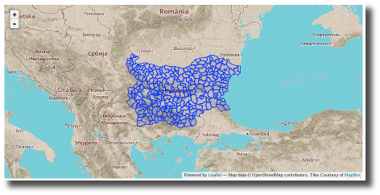

Common base layers for Map Widgets
==================================

To provide a consistent look and feel and avoiding code duplication, the map
widgets (at least the ones based on `Leaflet`_) can use a common function to
create the map. The base layer that the map will use can be configured via
configuration options.

Configuring the base layer
--------------------------

The main configuration option to manage the base layer used is
``ckanext.spatial.common_map.type``. Depending on the map type additional
options may be required. The spatial extension provides default settings for
popular tiles providers based on `OpenStreetMap`_, but you can use any tileset
that follows the `XYZ convention`_.

.. note:: All tile providers have Terms of Use and will most likely require
    proper attribution. Make sure to read and understand the terms and add
    the relevant attribution before using them on your CKAN instance.

MapQuest-OSM
++++++++++++

The `MapQuest-OSM`_ tiles are provided by `MapQuest`_, and are based on data by
OpenStreetMap. This is the default base layer used by the map widgets, and you
don't need to add any configuration option to use them. If you want to define
it explicitly though, use the following setting::

    ckanext.spatial.common_map.type = mapquest

.. image:: _static/base-map-mapquest.png

MapBox
++++++

`MapBox`_ allows to define your custom maps based on OpenStreetMap data, using
their online editor or the more advanced `TileMill`_ desktop tool. You will
need to provide a map id with the ``[account].[handle]`` form (Check `here`_
for more details)::

    ckanext.spatial.common_map.type = mapbox
    ckanext.spatial.common_map.mapbox.map_id = youraccount.map-xxxxxxxx

Custom
++++++

You can use any tileset that follows the `XYZ convention`_ using the ``custom``
type::

    ckanext.spatial.common_map.type = custom

You will need to define the tileset URL using
``ckanext.spatial.common_map.custom.url``. This follows the `Leaflet URL
template`_ format (ie {s} for subdomains if any, {z} for zoom and {x} {y} for
tile coordinates). Additionally you can use
``ckanext.spatial.common_map.subdomains`` and
``ckanext.spatial.common_map.attribution`` if needed (these two will also work
for MapQuest and MapBox layers if you want to tweak the defaults.

This is a complete example that uses `Stamen`_'s famous `watercolor maps`_::

    ckanext.spatial.common_map.type = custom
    ckanext.spatial.common_map.custom.url = http://tile.stamen.com/watercolor/{z}/{x}/{y}.jpg
    ckanext.spatial.common_map.attribution = Map tiles by <a href="http://stamen.com">Stamen Design</a>, under <a href="http://creativecommons.org/licenses/by/3.0">CC BY 3.0</a>. Data by <a href="http://openstreetmap.org">OpenStreetMap</a>, under <a href="http://creativecommons.org/licenses/by-sa/3.0">CC BY SA</a>.

.. note:: For custom base layers you need to manually modify the attribution
    link on the templates for widgets on the sidebar, like the spatial query
    and dataset map widgets.

For developers
--------------

To pass the base map configuration options to the relevant Javascript module
that will initialize the map widget, use the ``h.get_common_map_config()``
helper function. This is available when loading the ``spatial_metadata``
plugin. If you don't want to require this plugin, create a new helper function
that points to it to avoid duplicating the names, which CKAN won't allow (see
for instance how the GeoJSON preview plugin does it).

The function will return a dictionary with all configuration options that
relate to the common base layer (that's all that start with
``ckanext.spatial.common_map.``)

You will need to dump the dict as JSON on the ``data-module-map_config``
attribute (see for instance the ``dataset_map_base.html`` and
``spatial_query.html`` snippets)::

  
  

    

  

  

    
  

Once at the Javascript module level, all Leaflet based map widgets should use
the ``ckan.commonLeafletMap`` constructor to initialize the map. It accepts the
following parameters:

* ``container``: HTML element or id of the map container
* ``mapConfig``: (Optional) CKAN config related to the common base layer
* ``leafletMapOptions``: (Optional) Options to pass to the Leaflet Map constructor
* ``leafletBaseLayerOptions``: (Optional) Options to pass to the Leaflet TileLayer
  constructor

Most of the times you will want to do something like this for a sidebar map::

      var map = ckan.commonLeafletMap('dataset-map-container', this.options.map_config, {attributionControl: false});

And this for a primary content map::

      var map = ckan.commonLeafletMap('map', this.options.map_config);

.. _Leaflet: http://leafletjs.com
.. _OpenStreetMap: http://openstreetmap.org
.. _`XYZ convention`: http://wiki.openstreetmap.org/wiki/Slippy_map_tilenames
.. _MapQuest-OSM: http://developer.mapquest.com/web/products/open/map
.. _MapQuest: http://www.mapquest.com/
.. _MapBox: http://www.mapbox.com/
.. _TileMill: http://www.mapbox.com/tilemill/
.. _here: http://www.mapbox.com/developers/api-overview/
.. _`Leaflet URL template`: http://leafletjs.com/reference.html#url-template
.. _Stamen: http://stamen.com/
.. _`watercolor maps`: http://maps.stamen.com/watercolor/
