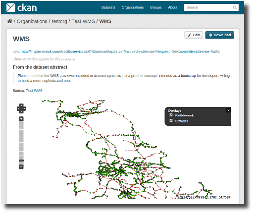

============================
Previews for Spatial Formats
============================

The extension includes some plugins that implement the IResourcePreview_
interface, allowing to preview spatial resource files. They are based in
popular Javascript mapping libraries and should be really easy to extend and
adapt to your own needs.

GeoJSON Preview
---------------

.. image:: _static/preview-geojson.png

The GeoJSON previewer is based on Leaflet_. It will render GeoJSON_ files on a
map and add a popup showing the features properties, for those resources that
have a format of ``geojson`` or ``gjson``.

To enable the GeoJSON previewer you need to add the ``geojson_preview`` plugin
to your ini file. This plugin also requires the `resource_proxy`_
plugin (Make sure you load the ``resource_proxy`` plugin before any other
from the spatial extension)::

    ckan.plugins = resource_proxy geojson_preview

WMS Preview
-----------

The WMS previewer is based on OpenLayers_. When the plugin is enabled, if
datasets contain a resource that has ``wms`` format, the resource page will
load a simple map viewer that will attempt to load the remote service layers,
based on the GetCapabilities response. In order for the proxy to get correct
response, the URL of the resource must be a full GetCapabilities request, not
just the main WMS service endpoint, for example:

http://vmap0.tiles.osgeo.org/wms/vmap0?SERVICE=WMS&REQUEST=GetCapabilities&VERSION=1.1.1

To enable the WMS previewer you need to add the ``wms_preview`` plugin to your
ini file. This plugin also requires the `resource_proxy`_
plugin (Make sure you load the ``resource_proxy`` plugin before any other
from the spatial extension::

    ckan.plugins = resource_proxy wms_preview

.. note:: Please note that the WMS previewer included in ckanext-spatial is
          just a proof of concept and has important limitations, and is
          just intended as a bootstrap for developers willing to build a more
          sophisticated one.

          Some projects that have built more advanced map viewers and
          integrated them with CKAN include:

          * Data.gov.uk (http://data.gov.uk):
                - https://github.com/datagovuk/ckanext-dgu
                - https://github.com/datagovuk/ckanext-os

          * Catalog.data.gov (http://catalog.data.gov):
                - https://github.com/okfn/ckanext-geodatagov
                - https://github.com/chilukey/viewer

.. _IResourcePreview: http://docs.ckan.org/en/latest/writing-extensions.html#ckan.plugins.interfaces.IResourcePreview
.. _resource_proxy: http://docs.ckan.org/en/latest/data-viewer.html#viewing-remote-resources-the-resource-proxy
.. _Leaflet: http://leafletjs.org
.. _GeoJSON: http://geojson.org
.. _OpenLayers: http://openlayers.org

