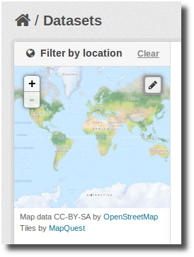
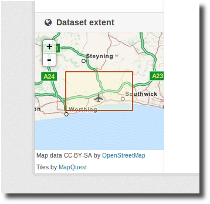

==============
Spatial Search
==============

The spatial extension allows to index datasets with spatial information so they
can be filtered via a spatial query. This includes both via the web interface
(see the `Spatial Search Widget`_) or via the `action API`_, e.g.::

    POST http://localhost:5000/api/action/package_search
        { "q": "Pollution",
          "facet": "true",
          "facet.field": "country",
          "extras": {
              "ext_bbox": "-7.535093,49.208494,3.890688,57.372349" }
        }

.. versionchanged:: 2.0.1
   Starting from this version the spatial filter it is also supported on GET
   requests:

   http://localhost:5000/api/action/package_search?q=Pollution&ext_bbox=-7.535093,49.208494,3.890688,57.372349

Setup
-----

To enable the spatial query you need to add the ``spatial_query`` plugin to
your ini file. This plugin requires the ``spatial_metadata`` plugin, eg::

  ckan.plugins = [other plugins] spatial_metadata spatial_query

To define which backend to use for the spatial search use the following
configuration option (see `Choosing a backend for the spatial search`_)::

  ckanext.spatial.search_backend = solr

Geo-Indexing your datasets
--------------------------

Regardless of the backend that you are using, in order to make a dataset
queryable by location, an special extra must be defined, with its key named
'spatial'. The value must be a valid GeoJSON_ geometry, for example::

    { 
      "type":"Polygon",
      "coordinates":[[[2.05827, 49.8625],[2.05827, 55.7447], [-6.41736, 55.7447], [-6.41736, 49.8625], [2.05827, 49.8625]]]
    }

or::

    { 
      "type": "Point",
      "coordinates": [-3.145,53.078]
    }

Every time a dataset is created, updated or deleted, the extension will
synchronize the information stored in the extra with the geometry table.

Choosing a backend for the spatial search
+++++++++++++++++++++++++++++++++++++++++

There are different backends supported for the spatial search, it is important
to understand their differences and the necessary setup required when choosing
which one to use.

The following table summarizes the different spatial search backends:

+------------------------+---------------+-------------------------------------+-----------------------------------------------------------+-------------------------------------------+
| Backend                | Solr Versions | Supported geometries                | Sorting and relevance                                     | Performance with large number of datasets |
+========================+===============+=====================================+===========================================================+===========================================+
| ``solr``               | 3.1 to 4.x    | Bounding Box                        | Yes, spatial sorting combined with other query parameters | Good                                      |
+------------------------+---------------+-------------------------------------+-----------------------------------------------------------+-------------------------------------------+
| ``solr-spatial-field`` | 4.x           | Bounding Box, Point and Polygon [1] | Not implemented                                           | Good                                      |
+------------------------+---------------+-------------------------------------+-----------------------------------------------------------+-------------------------------------------+
| ``postgis``            | 1.3 to 4.x    | Bounding Box                        | Partial, only spatial sorting supported [2]               | Poor                                      |
+------------------------+---------------+-------------------------------------+-----------------------------------------------------------+-------------------------------------------+

[1] Requires JTS

[2] Needs ``ckanext.spatial.use_postgis_sorting`` set to True

We recommend to use the ``solr`` backend whenever possible. Here are more
details about the available options:

* ``solr`` (Recommended)
    This option uses normal Solr fields to index the relevant bits of
    information about the geometry and uses an algorithm function to sort
    results by relevance, keeping any other non-spatial filtering. It only
    supports bounding boxes both for the geometries to be indexed and the
    input query shape. It requires `EDisMax`_ query parser, so it will only
    work on versions of Solr greater than 3.1 (We recommend using Solr 4.x).

    You will need to add the following fields to your Solr schema file to
    enable it::

        <fields>
            <!-- ... -->
            <field name="bbox_area" type="float" indexed="true" stored="true" />
            <field name="maxx" type="float" indexed="true" stored="true" />
            <field name="maxy" type="float" indexed="true" stored="true" />
            <field name="minx" type="float" indexed="true" stored="true" />
            <field name="miny" type="float" indexed="true" stored="true" />
        </fields>
    The solr schema file is typically located at: (..)/src/ckan/ckan/config/solr/schema.xml

* ``solr-spatial-field``
    This option uses the `spatial field`_ introduced in Solr 4, which allows
    to index points, rectangles and more complex geometries (complex geometries
    will require `JTS`_, check the documentation).
    Sorting has not yet been implemented, users willing to do so will need to
    modify the query using the ``before_search`` extension point.

    You will need to add the following field type and field to your Solr
    schema file to enable it (Check the `Solr documentation`__ for more
    information on the different parameters, note that you don't need
    ``spatialContextFactory`` if you are not using JTS)::

        <types>
            <!-- ... -->
            <fieldType name="location_rpt" class="solr.SpatialRecursivePrefixTreeFieldType"
                spatialContextFactory="com.spatial4j.core.context.jts.JtsSpatialContextFactory"
                distErrPct="0.025"
                maxDistErr="0.000009"
                units="degrees" />
        </types>
        <fields>
            <!-- ... -->
            <field name="spatial_geom"  type="location_rpt" indexed="true" stored="true" multiValued="true" />
        </fields>

* ``postgis``
    This is the original implementation of the spatial search. It
    does not require any change in the Solr schema and can run on Solr 1.x,
    but it is not as efficient as the previous ones. Basically the bounding
    box based query is performed in PostGIS first, and the ids of the matched
    datasets are added as a filter to the Solr request. This, apart from being
    much less efficient, can led to issues on Solr due to size of the requests
    (See `Solr configuration issues on legacy PostGIS backend`_). There is
    support for a spatial ranking on this backend (setting
    ``ckanext.spatial.use_postgis_sorting`` to True on the ini file), but
    it can not be combined with any other filtering.

Spatial Search Widget
---------------------

The extension provides a snippet to add a map widget to the search form, which
allows filtering results by an area of interest.

To add the map widget to the to the sidebar of the search page, add this to the
dataset search page template
(``myproj/ckanext/myproj/templates/package/search.html``)::

    

      

    

By default the map widget will show the whole world. If you want to set up a
different default extent, you can pass an extra ``default_extent`` to the
snippet, either with a pair of coordinates like this::

  

or with a GeoJSON object describing a bounding box (note the escaped quotes)::

  

You need to load the ``spatial_metadata`` and ``spatial_query`` plugins to use this
snippet.

Dataset Extent Map
------------------

Using the snippets provided, if datasets contain a ``spatial`` extra like the
one described in the previous section, a map will be shown on the dataset
details page.

There are snippets already created to load the map on the left sidebar or in
the main body of the dataset details page, but these can be easily modified to
suit your project needs

To add a map to the sidebar, add the following block to the dataset details page template (eg
``ckanext-myproj/ckanext/myproj/templates/package/read.html``). If your custom 
theme is simply extending the CKAN default theme, you will need to add ```` 
to the start of your custom read.html, then continue with this::

    
      {{ super() }}

      
      
        
      

    

For adding the map to the main body, add this::

    

      {{ super() }}

      
      
        
      

    

You need to load the ``spatial_metadata`` plugin to use these snippets.

Legacy Search
-------------

Solr configuration issues on legacy PostGIS backend
+++++++++++++++++++++++++++++++++++++++++++++++++++

.. warning::

    If you find any of the issues described in this section it is strongly
    recommended that you consider switching to one of the Solr based backends
    which are much more efficient. These notes are just kept for informative
    purposes.

If using Spatial Query functionality then there is an additional SOLR/Lucene
setting that should be used to set the limit on number of datasets searchable
with a spatial value.

The setting is ``maxBooleanClauses`` in the solrconfig.xml and the value is the
number of datasets spatially searchable. The default is ``1024`` and this could
be increased to say ``16384``. For a SOLR single core this will probably be at
`/etc/solr/conf/solrconfig.xml`. For a multiple core set-up, there will me
several solrconfig.xml files a couple of levels below `/etc/solr`. For that
case, *all* of the cores' `solrconfig.xml` should have this setting at the new
value.

Example::

      <maxBooleanClauses>16384</maxBooleanClauses>

This setting is needed because PostGIS spatial query results are fed into SOLR
using a Boolean expression, and the parser for that has a limit. So if your
spatial area contains more than the limit (of which the default is 1024) then
you will get this error::

 Dataset search error: ('SOLR returned an error running query...

and in the SOLR logs you see::

 too many boolean clauses ...  Caused by:
 org.apache.lucene.search.BooleanQuery$TooManyClauses: maxClauseCount is set to
 1024

Legacy API
++++++++++

The extension adds the following call to the CKAN search API, which returns
datasets with an extent that intersects with the bounding box provided::

    /api/2/search/dataset/geo?bbox={minx,miny,maxx,maxy}[&crs={srid}]

If the bounding box coordinates are not in the same projection as the one
defined in the database, a CRS must be provided, in one of the following forms:

- `urn:ogc:def:crs:EPSG::4326`
- EPSG:4326
- 4326

.. _action API: http://docs.ckan.org/en/latest/apiv3.html
.. _edismax: http://wiki.apache.org/solr/ExtendedDisMax
.. _JTS: http://www.vividsolutions.com/jts/JTSHome.htm
.. _spatial field: http://wiki.apache.org/solr/SolrAdaptersForLuceneSpatial4
__ `spatial field`_
.. _GeoJSON: http://geojson.org
